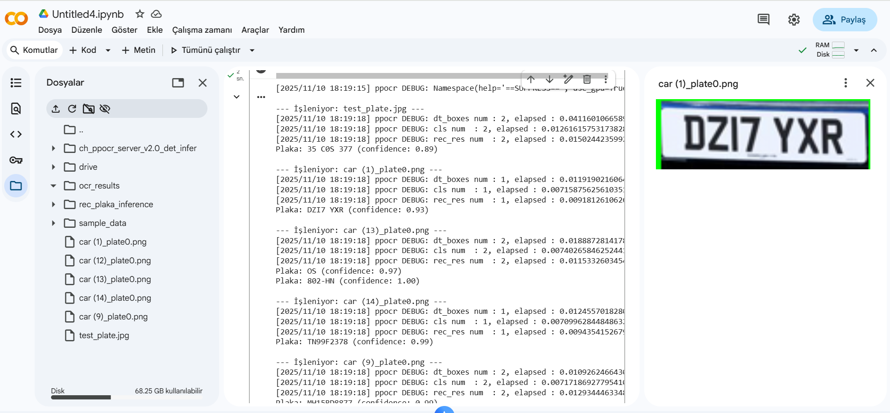
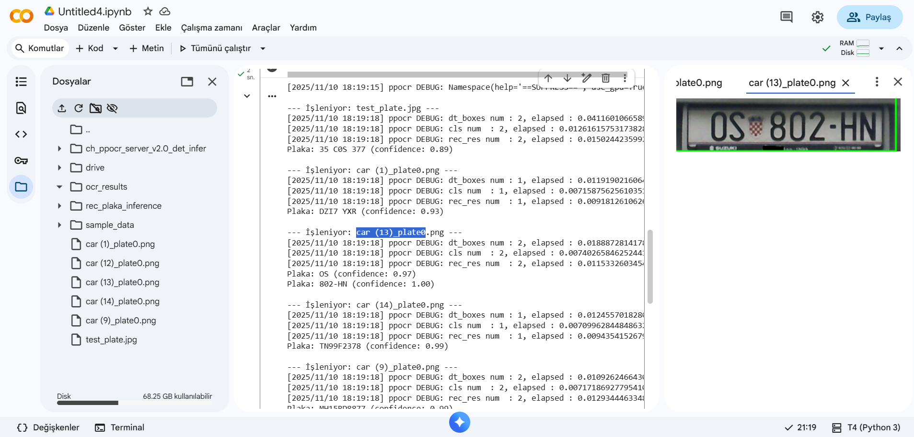
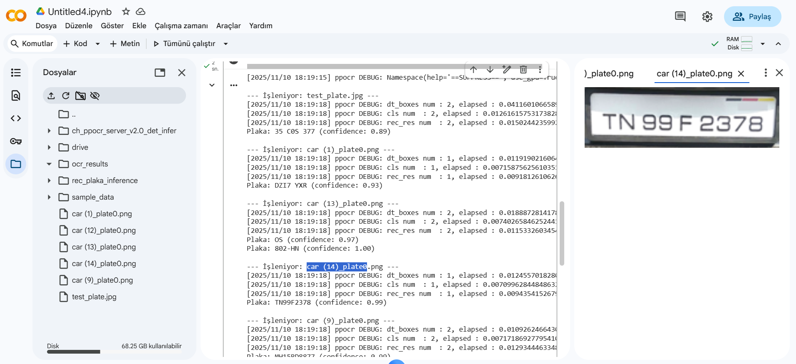
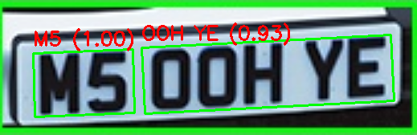
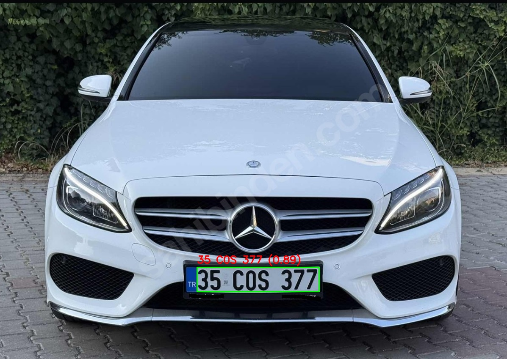

#  License Plate Recognition Project

A simple Python PaddleOCR project for detecting and reading vehicle license plates from images. Results are saved as labeled images.

---
## Training data is available at the link below

https://drive.google.com/drive/folders/10Ex262qLoQUZWjSuehk4Hhjr8EH1B-MN?usp=sharing

---

## 🖼️ Single Control

---

## 🖼️ Multiple Control

---
## 🖼️ Record To Folder

---
